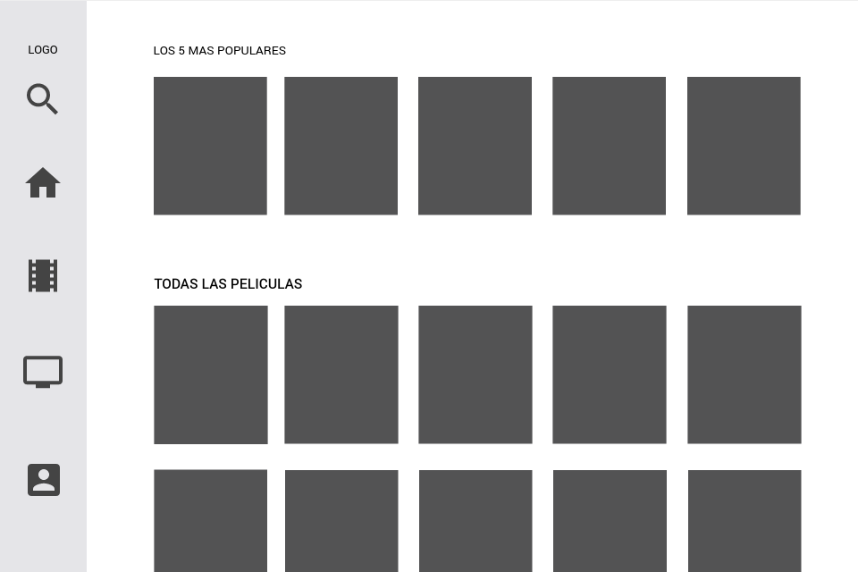
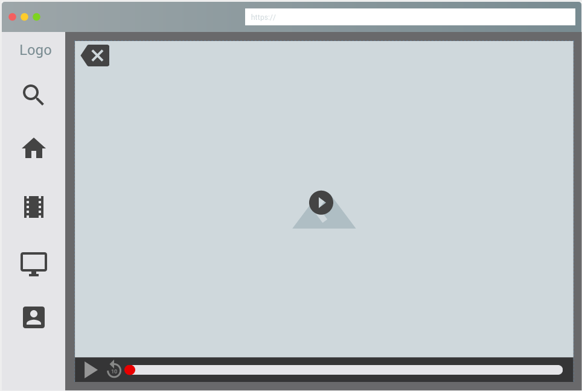
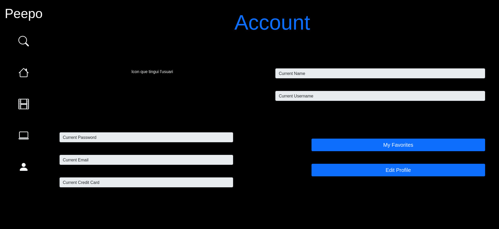

# Projecte Streaming Peepo

### Versió --> 1.0
 
## 01. Instalacion Laravel
### Instala con Docker un servidor PHP en el que ejecutar la instalación de Laravel (Hello World)
#### a) Conexión con el servidor
```
ssh daw@10.200.248.172
```
#### b) Instalación Laravel
```
curl -s "https://laravel.build/example-app" | bash

cd example-app

./vendor/bin/sail up
```

#### c) Git del proyecto
[Link del repositori del git](https://gitlab.com/iawblancaserna/gbi)
## 02. Diagrama de casos de uso
### Realizar un diagrama donde se especifiquen todas las acciones que pueda realizar un usuario (con sus diferentes perfiles)


## 03. Diagrama de base de datos
### Realizar el diagrama de la base de datos

## 04. Mockups
### Realizar los mockups de cada una de las páginas:
#### a) Home
#####   - Home 1

#####   - Home 2

#### b) Lista de Peliculas

#### c) Resultado de busqueda

#### d) Pantalla de Login


#### e) Formulario de registro

### -> Usuarios
#### f) Formulario de pago. 👫 No hacen esta pagina

#### g) Formulario datos de usuario
#### - Users

#### - Admins

#### - Editar perfils d'usuaris


#### h) Visualizar streaming

#### i) Pagina favoritos/recomendados 👫 No hacen los recomendados

### -> Administrador
#### j) Lista de usuarios  

#### k) Lista de peliculas

#### l) Información de usuario

#### m) Pagina de autorización. 👫 No hacen esta página

#### m) Insertar/modificar pelicula


## 05. Lista de URLs
### Crear la lista de URLs que conformarán la web con una breve descripción (incluida la información que se mostrará y la tabla de la DB donde se encuentra esa información)

## 06. Crear la base de datos
### Usar las herramientas del Framework para crear la base de datos (tablas y contenido dummy)
[Link a la bd](https://gitlab.com/iawblancaserna/gbi/-/tree/main/database)
## 07. Programar las vistas (solo HTML) de la aplicación diseñadas en los Mockups con las herramientas del Framework y Bootstrap utilizando información dummy  
#### Home1
  
#### Home2
  
#### Sign up
  
#### Payment
  
#### Login
  
#### Profile
  
#### Edit Profile
  
#### Search
  
#### MovieList
  
#### Favorites
  
## 08. Crear la página de la home.
  
## 09. Crear la pagina que lista las peliculas

#### a) Controller que carga la vista de todas las peliculas
#### b) Model que devuelve la lista de peliculas
#### c) Controller que recibe la petición de filtro de peliculas
#### d) Model que devuelve la lista de peliculas filtradas
  
## 10. Crear el proceso de registro
#### a) Controller que carga la vista del formulario
#### b) Verificador de formulario
#### c) Controller que procesa los datos del formulario
#### d) Model que guarda los datos del formulario
#### e) Control de usuario ya existe
  
## 11. Crear el proceso de login guardando las credenciales en session/cookie utilizando las herramientas del Framework
#### a) Controller que carga la vista del formulario
#### b) Verificador de formulario
#### c) Controller que procesa los datos del formulario
#### d) Model que gestiona los datos del formulario
#### e) Si autorizado cargar los datos en session/cookies
  
## 12. Crear la página del resultado de busqueda
## 13. Crear la página de streaming
## 14. Crear la página de formulario de pago
## 15. (admin) Crear la pagina de lista de usuarios
## 16. (admin) Crear admin de usuario
## 17. (admin) Crear la pagina de lista de peliculas/series
## 18. (admin) Crear admin de peliculas/series
